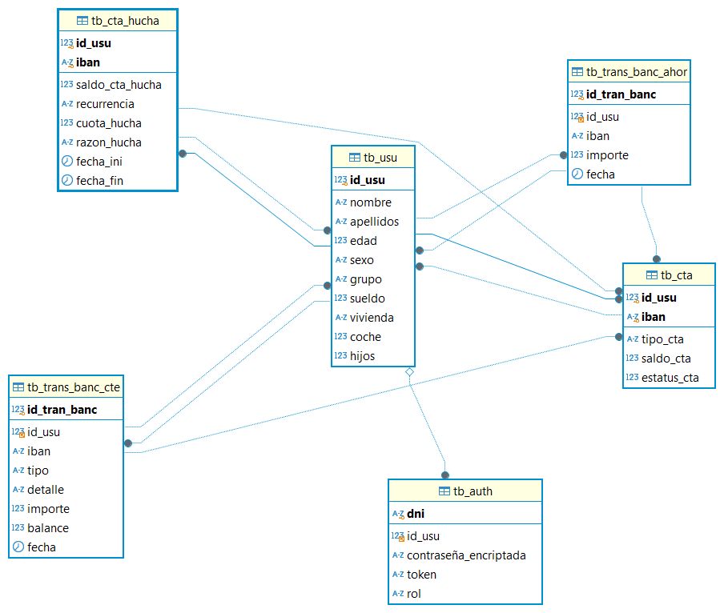

# **🏦 BBK-KUTXABANK MySQL - Base de Datos bd\_reto**

La base de datos `bd_reto` fue diseñada en MySQL para proporcionar soporte al equipo de desarrollo FullStack, utilizando DBeaverCE como herramienta de gestión de la base de datos. A continuación, se detallan las tablas que componen la base de datos, junto con sus respectivas columnas y relaciones.

## **📋 Tabla tb\_usu**

**Descripción**: Esta tabla almacena la información general de los usuarios.

**Columnas**:

`id_usu` (int, NOT NULL): Identificador único del usuario.

`nombre` (varchar(45)): Nombre del usuario.

`apellidos` (varchar(45)): Apellidos del usuario.

`edad` (int): Edad del usuario.

`sexo` (varchar(45)): Sexo del usuario.

`grupo` (varchar(45)): Grupo al que pertenece el usuario.

`sueldo` (int): Sueldo del usuario.

`vivienda` (varchar(45)): Tipo de vivienda del usuario.

`coche` (tinyint(1)): Indica si el usuario tiene coche (1) o no (0).

`hijos` (int): Número de hijos del usuario.

**Llave primaria**: `id_usu`.

## **🔒 Tabla tb\_auth**

**Descripción**: Almacena la información de autenticación de los usuarios.

**Columnas**:

`dni` (varchar(20), NOT NULL): Documento Nacional de Identidad del usuario.

`id_usu` (int): Identificador del usuario, relacionado con la tabla `tb_usu`.

`contraseña_encriptada` (varchar(255), NOT NULL): Contraseña encriptada del usuario.

`token` (varchar(255)): Token de autenticación.

`rol` (enum('cliente', 'admin'), NOT NULL): Rol del usuario dentro del sistema (cliente o administrador).

**Llave primaria**: `dni`.

**Llave foránea**: `id_usu` (referencia a `tb_usu(id_usu)`, con eliminación en cascada SET NULL).

## **🏦 Tabla tb\_cta**

**Descripción**: Almacena la información de las cuentas bancarias de los usuarios.

**Columnas**:

`id_usu` (int, NOT NULL): Identificador del usuario, relacionado con la tabla `tb_usu`.

`iban` (varchar(45), NOT NULL): IBAN de la cuenta bancaria.

`tipo_cta` (varchar(45), NOT NULL): Tipo de cuenta (corriente o de ahorro).

`saldo_cta` (int, NOT NULL): Saldo actual de la cuenta.

`estatus_cta` (int, NOT NULL): Estado de la cuenta (activa, inactiva, bloqueada, etc.).

**Llave primaria**: Combinación de `id_usu` y `iban`.

**Llave foránea**: `id_usu` (referencia a `tb_usu(id_usu)`).

## **💰 Tabla tb\_cta\_hucha**

**Descripción**: Almacena la información de las cuentas de ahorro de los usuarios.

**Columnas**:

`id_usu` (int, NOT NULL): Identificador del usuario, relacionado con la tabla `tb_usu`.

`iban` (varchar(45), NOT NULL): IBAN de la cuenta de ahorro.

`saldo_cta_hucha` (int, NOT NULL): Saldo de la cuenta de ahorro.

`recurrencia` (varchar(45), NOT NULL): Frecuencia de los depósitos en la cuenta (diaria, mensual, etc.).

`cuota_hucha` (int, NOT NULL): Cuota de ahorro fijada.

`razon_hucha` (varchar(45), NOT NULL): Razón del ahorro (compra de vivienda, emergencias, etc.).

`fecha_ini` (date, NOT NULL): Fecha de inicio del plan de ahorro.

`fecha_fin` (date, NOT NULL): Fecha estimada de finalización del plan de ahorro.

**Llave primaria**: Combinación de `id_usu` y `iban`.

**Llave foránea**: `id_usu` (referencia a `tb_usu(id_usu)`).

## **💳 Tabla tb\_trans\_banc\_ahor**

**Descripción**: Registra las transacciones bancarias relacionadas con cuentas de ahorro.

**Columnas**:

`id_tran_banc` (int, NOT NULL): Identificador único de la transacción bancaria.

`id_usu` (int, NOT NULL): Identificador del usuario, relacionado con la tabla `tb_usu`.

`iban` (varchar(45), NOT NULL): IBAN de la cuenta relacionada con la transacción.

`importe` (int): Importe de la transacción.

`fecha` (date): Fecha en que se realizó la transacción.

**Llave primaria**: `id_tran_banc`.

**Llave foránea**: `id_usu` (referencia a `tb_usu(id_usu)`).

## **💼 Tabla tb\_trans\_banc\_cte**

**Descripción**: Almacena las transacciones bancarias de las cuentas corrientes de los usuarios.

**Columnas**:

`id_tran_banc` (int, NOT NULL): Identificador único de la transacción bancaria.

`id_usu` (int, NOT NULL): Identificador del usuario, relacionado con la tabla `tb_usu`.

`iban` (varchar(45), NOT NULL): IBAN de la cuenta relacionada con la transacción.

`tipo` (varchar(45)): Tipo de transacción (ingreso, gasto, transferencia, etc.).

`detalle` (varchar(45)): Descripción o detalle de la transacción.

`importe` (int): Importe de la transacción.

`balance` (int): Balance restante después de la transacción.

`fecha` (date): Fecha en que se realizó la transacción.

**Llave primaria**: `id_tran_banc`.

**Llave foránea**: `id_usu` (referencia a `tb_usu(id_usu)`).

## **🔗 Relaciones entre Tablas**

La base de datos establece varias relaciones entre las tablas, principalmente a través de la columna `id_usu` en la tabla `tb_usu`. Estas relaciones permiten la gestión y el seguimiento de las transacciones bancarias, la información de autenticación y las cuentas bancarias de los usuarios:

`tb_auth` referencia a `tb_usu` a través de `id_usu`.

`tb_cta` referencia a `tb_usu` a través de `id_usu`.

`tb_cta_hucha` referencia a `tb_usu` a través de `id_usu`.

`tb_trans_banc_ahor` referencia a `tb_usu` a través de `id_usu`.

`tb_trans_banc_cte` referencia a `tb_usu` a través de `id_usu`.

Estas relaciones aseguran la integridad referencial de la base de datos, permitiendo mantener una estructura sólida para la información de los usuarios, sus cuentas y transacciones.

## **📊 Diagrama de Relaciones**

El diagrama de relaciones de la base de datos `bd_reto` muestra visualmente cómo están conectadas las tablas a través de las llaves foráneas. Esto refleja la interdependencia de las tablas, con la tabla `tb_usu` como el núcleo central de la base de datos, referenciada por la mayoría de las otras tablas.

## **📝 Conclusión**
